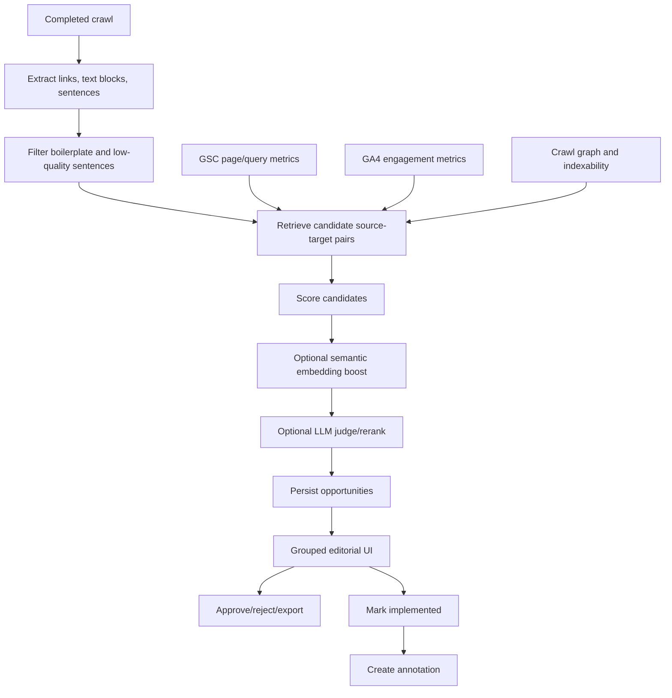

# Internal Links Engine Plan

## Purpose

The Internal Links engine turns crawl, Google Search Console, GA4, and page-content context into editorial internal-link recommendations that an agency team can trust and implement manually.

A great recommendation answers four questions without making the editor investigate:

- Where should the link be added?
- Which exact words should be linked?
- Where should the link point?
- Why does this help the reader at that point in the article?

The target experience is an editorial brief grouped by source article:

```text
In "Source Article Title" · 3 links · open post

Anchor text to use                 Link it to                  Why a reader here benefits
"forecast my traffic"              Forecast SEO Traffic        A reader trying to plan...
```

## North Star

For each workspace site, produce screenshot-quality recommendations with:

- source article URL and title
- source sentence and heading/section context
- exact anchor text and character offsets
- target URL and title
- reader-benefit rationale
- confidence, priority score, and score breakdown
- status workflow: new, approved, rejected, implemented, stale
- user notes
- export to CSV and Markdown
- annotation creation when marked implemented

## Non-Goals For V1

- No CMS auto-publishing.
- No automatic editing of user websites.
- No requirement for hosted AI providers.
- No recommendation that cannot be implemented manually from the UI/export.

## Current Implementation Snapshot

Implemented:

- Internal Links sidebar/view.
- Crawl link context capture: anchor text and surrounding context.
- Sentence and text-block capture during crawl.
- Internal-link analysis jobs with queueing, rerun, cancel, stale handling, heartbeat-based running-job freshness, estimates, and workspace batch queueing.
- Persisted opportunities with exact source sentence, anchor offsets, target page, rationale, confidence, score, status, notes, and annotation link.
- Local rules-first recommendation engine.
- Managed built-in BGE-M3 semantic retrieval with lexical fallback; Ollama remains an optional provider.
- Strict structured judge gate for Ollama and hosted LLM providers with exact source sentence, target URL, anchor text, and anchor offset validation.
- Workspace provider settings UI/API with encrypted API-key storage and saved model/base URL defaults for Ollama, OpenAI, Anthropic, Gemini, OpenRouter, Jina, Cohere, and Voyage.
- CSV and Markdown export.
- Implemented-status annotation creation.
- Deterministic QA scripts for key invariants, quality fixtures, browser smoke, and Postgres pgvector retrieval.

Not yet state of the art:

- Hosted provider adapters are wired for embeddings (OpenAI, Gemini, Jina, Cohere, Voyage) and LLM judging (OpenAI, Gemini, Anthropic, OpenRouter), with retry/backoff and approximate actual-cost accounting; they still need provider-reported usage reconciliation and live-key acceptance tests.
- Sentence extraction has only lightweight boilerplate exclusion.
- Alternate recommendation exploration is not implemented yet.
- Route/database coverage is smoke-test based rather than a full test framework.

## Product Principles

1. Local-first by default.
   Large agencies may have hundreds of sites and millions of sentences. Hosted AI must be optional and cost-capped.

2. Exactness over cleverness.
   If the anchor text cannot be found exactly in the source sentence, reject the recommendation.

3. Retrieval before judgment.
   Never send all possible source-target pairs to an LLM. Use crawl/GSC/GA4/local embeddings to narrow candidates first.

4. Editorial usefulness matters.
   A link is good only when it helps the reader at that exact sentence, not merely because two pages share keywords.

5. Trust must be visible.
   Users need score breakdowns, existing-link evidence, target demand, and source context.

6. Manual workflow first.
   The user implements links manually, then marks them complete. Completion creates a site annotation.

## Data Flow



## Core Entities

### Crawl Link

Stored in `crawl_links`.

Must include:

- source URL/page key
- target URL/page key
- anchor text
- surrounding context
- job/site/owner scope

### Crawl Sentence

Stored in `crawl_page_sentences`.

Must include:

- page URL/page key
- paragraph index
- sentence index
- sentence text
- text hash
- embedding status
- extraction version eventually

Future fields:

- heading context
- section title
- boilerplate score
- link density
- sentence quality score
- extraction version

### Analysis Job

Stored in `internal_link_analysis_jobs`.

Must track:

- owner/site/crawl/date-range scope
- status and progress
- provider/model fields
- cost estimates and actual usage
- start/update/completion times
- errors/warnings

### Opportunity

Stored in `internal_link_opportunities`.

Must track:

- source URL/page key/title
- source sentence
- paragraph/sentence indexes
- anchor text and offsets
- target URL/page key/title
- reader benefit
- confidence and priority score
- opportunity type
- status, notes, stale flag
- provider/model version
- annotation id and implemented timestamp

Implemented score metadata:

- score breakdown JSON
- target need
- source authority
- topic match
- semantic boost
- anchor quality
- safety/diversity notes

Future fields:

- LLM judge reason/reject reason
- raw semantic similarity score
- alternate recommendation candidates
- extraction quality diagnostics

## Recommendation Pipeline

### 1. Eligibility

Target pages must be:

- successful 2xx crawl pages
- indexable
- not noindex
- not canonicalized away
- not known error pages

Source pages must be:

- successful 2xx crawl pages
- indexable
- have usable body/article sentences
- not already linking to the target

### 2. Target Need

Prioritize targets with:

- low inbound internal link count
- orphan or near-orphan risk
- GSC impressions
- rankings in positions 4-20
- many distinct queries
- GA4 engagement but weak search visibility

### 3. Source Strength

Prefer sources with:

- shallower crawl depth
- traffic/clicks
- inbound links
- topical overlap with target
- relevant sentence/heading context

### 4. Candidate Matching

Use:

- target title/H1/meta/page-key tokens
- target GSC queries
- source sentence tokens
- local/Ollama BGE-M3 embeddings with self-hosted Postgres + pgvector retrieval
- Free database path hardened: pgvector retrieval uses sentence hash indexes, and Postgres migrations use an advisory startup lock.
- existing link exclusion

### 5. Scoring

Combine:

- target need
- source strength
- lexical overlap
- semantic similarity
- anchor quality
- safety/indexability
- diversity constraints

### 6. Optional LLM Judge

Run only on finalists.

Strict acceptance requirements:

- `anchorText` exists exactly in `sourceSentence`
- `anchorStart` and `anchorEnd` slice to the exact anchor
- target deepens the sentence context
- reader benefit is specific
- generic anchors are rejected

## Provider Strategy

Default:

- local rules-first scoring
- built-in BGE-M3 embeddings through the managed local worker; optional Ollama embeddings
- actual hosted spend: zero

Supported architecture:

- embeddings: managed built-in BGE-M3 by default with self-hosted Postgres + pgvector retrieval; optional Ollama; hosted adapters for OpenAI, Gemini, Jina, Cohere, and Voyage; Qdrant/LanceDB remain optional future vector services
- review/judge: local rules, Ollama, OpenAI, Gemini, Anthropic, OpenRouter-compatible endpoints

Cost controls:

- estimate before run
- max hosted spend per job
- max pages
- max sentences per page
- max recommendations per site
- max LLM finalists
- never LLM-judge all pairs

## Large Agency Requirements

The engine must work for:

- hundreds of workspace sites
- thousands of pages per site
- tens of thousands of usable sentences per site
- repeated reruns after recrawls
- local-first deployments on a VPS

Operational requirements:

- server-side workspace queueing
- duplicate active-job prevention
- cancel/rerun
- stale detection after new crawl
- resumable batching eventually
- provider failure fallback

## Acceptance Criteria

A recommendation is acceptable when:

- source and target are accessible to the active user/workspace
- source and target are indexable successful crawl pages
- source does not already link to target
- anchor offsets are exact
- anchor is descriptive and not generic
- reader benefit explains the reader need at that sentence
- score/confidence are persisted
- export includes all implementation fields
- implemented action creates one annotation only

## Open Risks

- Poor extraction can create noisy source sentences.
- Without LLM judging, some recommendations may be topically related but editorially weak.
- Very large reruns still need stronger resumable batching and worker heartbeat ownership.
- Hosted AI costs can surprise users unless capped and previewed.
- Multi-process workers need stronger lock ownership/heartbeat for very long embedding jobs.

## Next Implementation Slice

Next implementation priorities:

- Add provider-reported usage/cost reconciliation for hosted adapters.
- Add live-key acceptance tests for hosted embedding and judge providers.
- Add stronger worker ownership/leases for multi-worker deployments beyond timestamp heartbeat recovery.
- Add optional vector-service adapters only if deployments outgrow pgvector.
